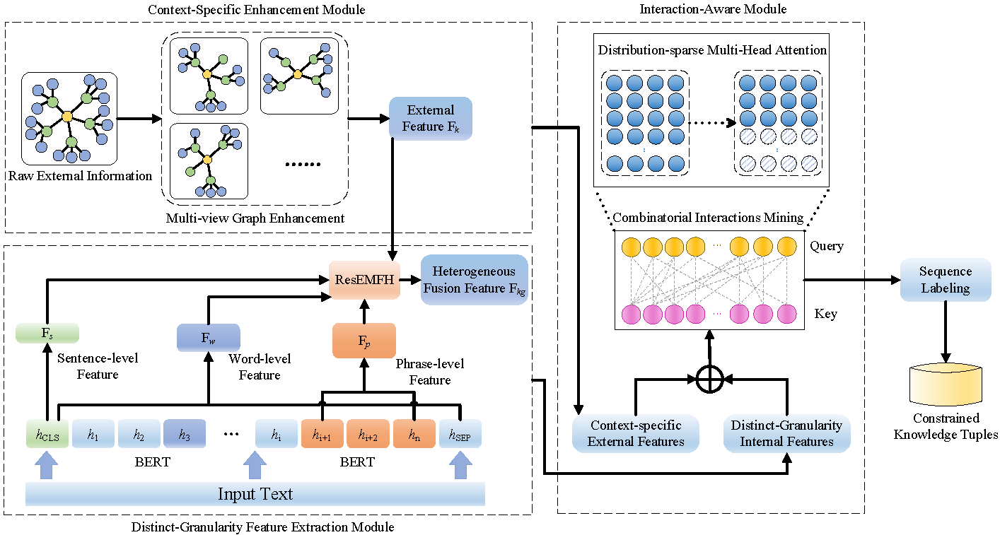

<h3 align="center">Constrained Tuple Extraction with Interaction-Aware Network</h3>
<p align="center">

This repository contains the code and dataset for our paper "Constrained Tuple Extraction with Interaction-Aware Network" (ACL 2023).

## Overview

This paper proposes a constrained tuple extraction (CTE) task to guarantee the validity of knowledge tuples. Formally, the CTE task is to extract constrained tuples from unstructured text, which adds constraints to conventional triples. To this end, we propose an interaction-aware network. Combinatorial interactions among context-specific external features and distinct-granularity internal features are exploited to effectively mine the potential constraints. Moreover, we have built a new dataset for training and evaluation.




## Installation

Require **python version >= 3.6**, recommend install with `pip`.

```shell
pip install -r requirements.txt
```

## Training and Evaluation

main.py --epochs 200 --mh_dropout 0.2 --arg_clf_dropout 0.2 --batch_size 90 --learning_rate 3e-5 --n_arg_heads 8 --n_arg_layers 4 --pos_emb_dim 64 --summary_step 2000 --mode cte

## Citation

If you find this repo helpful, please kindly cite the following paper:

```latex
@inproceedings{xue2023cte,
  author       = {Xiaojun Xue and
                  Chunxia Zhang and
                  Tianxiang Xu and
                  Zhendong Niu},
  title        = {Constrained Tuple Extraction with Interaction-Aware Network},
  booktitle    = {{ACL} {(1)}},
  pages        = {11430--11444},
  publisher    = {Association for Computational Linguistics},
  year         = {2023}
}
```
